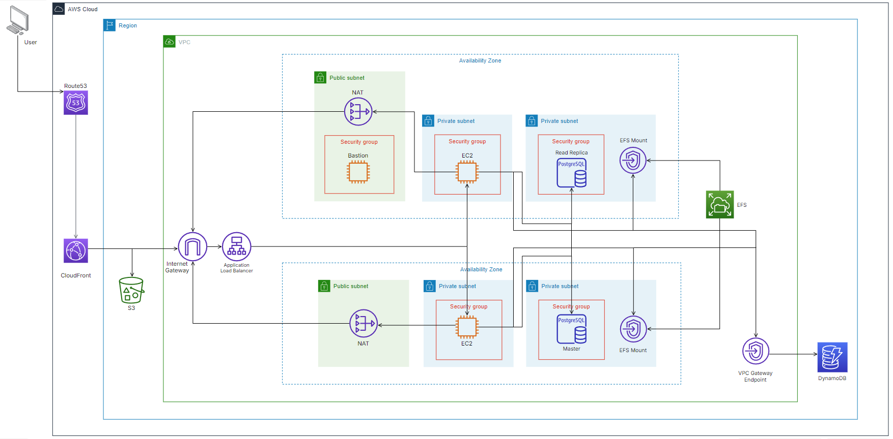

# Automated Infrastructure Management for Swiftext App using Terraform

## Overview

This repository contains the Infrastructure as Code (IaC) for Swiftext's 3-tier architecture, designed to manage web servers across three distinct layers: Presentation, Application, and Data. The architecture leverages Terraform for provisioning and managing cloud resources on AWS, with automation scripts that handle instance initialization, dependency management, and database setup to streamline deployment and maintenance.

---

## Architecture Diagram

Below is a high-level overview of the 3-tier architecture:

  
---

## Automation Scripts with Bash Scripting

During the creation of EC2 instances, user data scripts were populated to automate:
- **Project Dependency Management**: Installation of required software and libraries for running Swiftext backend application
- **Host-Level Configuration**: Setting up environment variables and managing permissions. Installing and configuring dependencies required by AWS services to support the app backend (eg. EFS dependencies, mounting EFS on application servers)
- **Database Initialization**: Automated setup and configuration of the database schema and initial data for Amazon RDS for PostgreSQL and Amazon DynamoDB


---

## Getting Started

### Prerequisites
- Terraform installed (v1.10.5)
- AWS CLI (v2.12.0) configured with appropriate credentials
- Git (v2.40.0) for version control

### Steps to Deploy
1. Clone the repository:
   ```bash
   git clone https://github.com/deeowemez/swiftext-infra.git
   cd swiftext-infra
   ```
2. Initialize Terraform
   ```bash
   terraform init
   ```
3. Review execution plan
   ```bash
   terraform plan
   ```
4. Apply configuration
   ```bash
   terraform apply
   ```

---

## Resources Used

The following AWS services were utilized in this project:

- **Amazon S3**
- **Amazon EC2**
- **Amazon RDS for PostgreSQL**
- **Amazon CloudFront**
- **Amazon EFS**
- **Amazon DynamoDB**
- **Amazon Route53**
- **Amazon NAT gateways**
- **Amazon Application Load Balancer**
- **VPC endpoints**
- **Mount Targets**


## In Progress
- Continuous Integration (CI) and Continuous Deployment (CD) Integration (Github Actions)
   - Add pipeline to automatically trigger Terraform plans and Terraform apply whenever changes are pushed to the repository
     - Terraform Validation: GitHub Actions will run Terraform validation checks to ensure that infrastructure code is clean
     - Terraform Plan: Automatically generate and review a Terraform plan on each pull request to preview infrastructure changes before they are applied
     - Terraform Apply: On merge to the main branch, GitHub Actions will automatically apply the changes to the infrastructure
